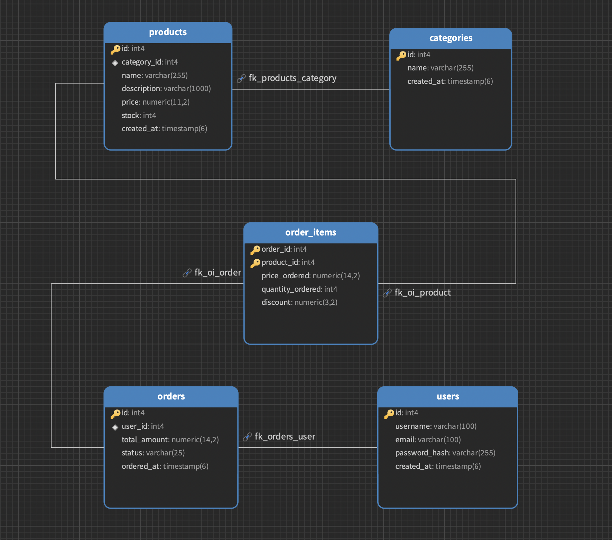
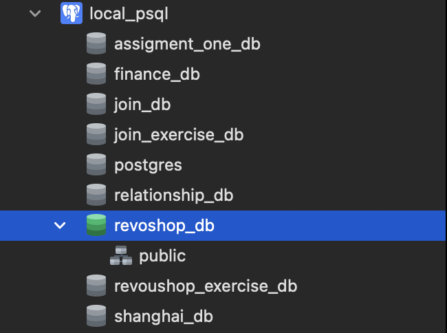

# Revoshop
**Revoshop** is a simple e-commerce application built for learning backend development and PostgreSQL.

## Description

Revoshop is a learning project that demonstrates the core features of an e-commerce system, including users, product categories, products, orders, and order items. It is designed for beginners who want to practice database design, SQL queries, and CRUD operations while understanding relationships, constraints, and indexing in PostgreSQL. The project serves as a hands-on example for building a solid foundation in backend development.


## Features

- User Management
- Product Management
- Product Categories
- Orders
- Order Items


## Tech Stack

- Python
- Flask
- PostgreSQL
- SQLAlchemy
- Reactjs and Typescript


## Database

This project uses **PostgreSQL** as the database.


### Tables

| Table | Description |
|--------|-------------|
| users | Store user information |
| product_categories | Store product categories |
| products | Store product information |
| orders | Store customer orders |
| order_items | Store products inside an order |

### Diagram Schema


## PostgreSQL Installation

### macOS (Homebrew)

1. Install PostgreSQL.

   ```
   brew install postgresql@18
   ```

2. Start the PostgreSQL service.

   ```
   brew services start postgresql@18
   ```

3. Verify the service is running.

   ```
   brew services list
   ```

   Example output:

   ```
    Name          Status  User   File 
    postgresql@18 started ismail ~/Library/LaunchAgents/homebrew.mxcl.postgresql@18.plist
   ```

4. Verify the installation.

   ```
   pgsql --version
   ```

5. Connect to PostgreSQL.

   ```
   psql postgres
   ```

   Example output:

   ```
    psql (18.4 (Homebrew))
    Type "help" for help.

    postgres=# 
   ```


---

### Windows

1. Download PostgreSQL from the [Official Website](https://www.postgresql.org/download/windows/).

2. Run the installer and follow the installation wizard.

3. During installation, configure:
   - **Password** for the `postgres` user
   - **Port:** `5432` (default)

4. After installation, open **SQL Shell (psql)** or your favorite terminal and verify the installation with:

   ```
   psql --version
   ```


## Configure the PostgreSQL Superuser Password

The default PostgreSQL superuser is **`postgres`**. If you need to set or change its password, follow the steps for your operating system.

### macOS (Homebrew)

1. Connect to PostgreSQL as the current local user.

   ```bash
   psql postgres
   ```

2. Change the password for the `postgres` user.

   ```sql
   ALTER USER postgres WITH PASSWORD 'your_secure_password';
   ```

3. Exit the PostgreSQL shell.

   ```sql
   \q
   ```

4. Verify that you can connect using the `postgres` user.

   ```bash
   psql -U postgres -d postgres -W
   ```

   Enter the password when prompted.

---

### Windows

1. Open **SQL Shell (psql)** or your favorite terminal.

2. Log in as the `postgres` user.

3. Run the following SQL command:

   ```sql
   ALTER USER postgres WITH PASSWORD 'your_secure_password';
   ```

4. Exit the PostgreSQL shell.

   ```sql
   \q
   ```

5. Verify the new password.

   ```bash
   psql -U postgres -d postgres -W
   ```

   Enter the password when prompted.


## Database Creation

### Steps

1. Open **Navicat Premium** and connect to your PostgreSQL server.
2. Right-click the connection and select **New Database**.
3. Enter ```revoshop_db``` as the database name.
4. Click **OK** to create the database.
5. Refresh the connection if necessary.
6. Verify that ```revoshop_db``` appears in the server tree under the PostgreSQL connection.

### Expected Result

The database ```revoshop_db``` is successfully created and visible in the Navicat server tree.




> **Note:** This guide uses **Navicat Premium** for the database setup. If you use a different PostgreSQL GUI tool (such as pgAdmin, DBeaver), feel free to follow the equivalent steps in your application. Although the interface may differ, the overall process of creating a database is generally very similar.


## Usage

After creating the `revoshop_db` database, execute the SQL scripts in the following order:

1. **`schema.sql`**
   Creates the database tables, constraints, and indexes.

2. **`seed.sql`**
   Inserts sample data into the tables, including categories, products, users, orders, and order items.

3. **`queries.sql`**
   Contains example SQL queries for practicing and exploring PostgreSQL features

Run each script using your favorite PostgreSQL GUI tool (such as Navicat Premium, pgAdmin, DBeaver, or the `psql` CLI tool) against the `revoshop_db` database.


